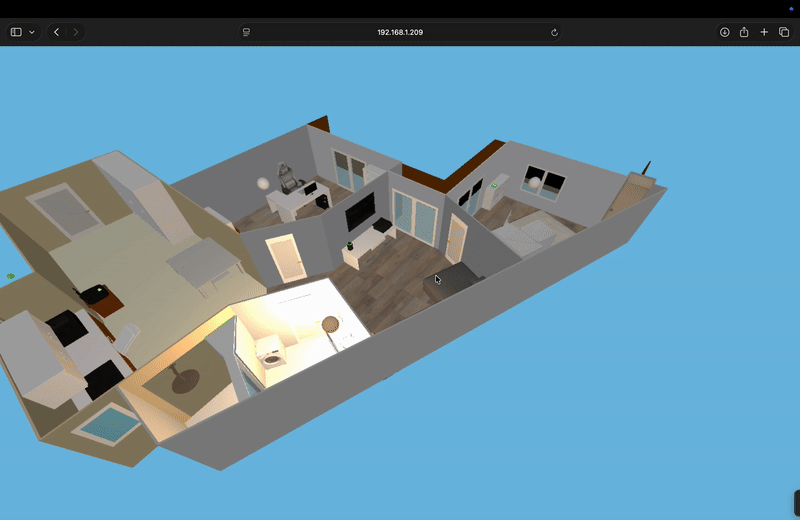
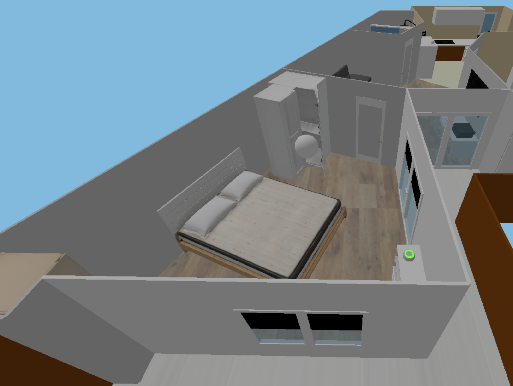
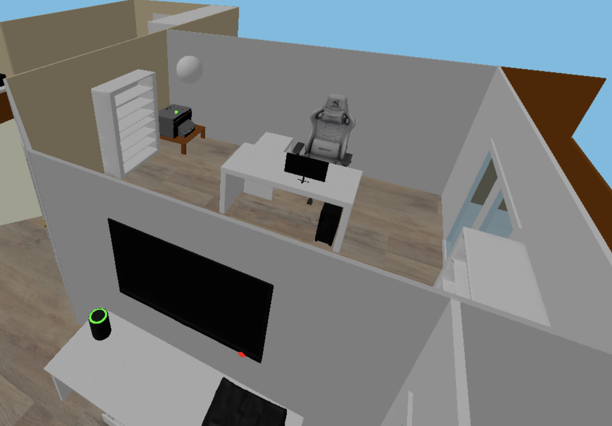
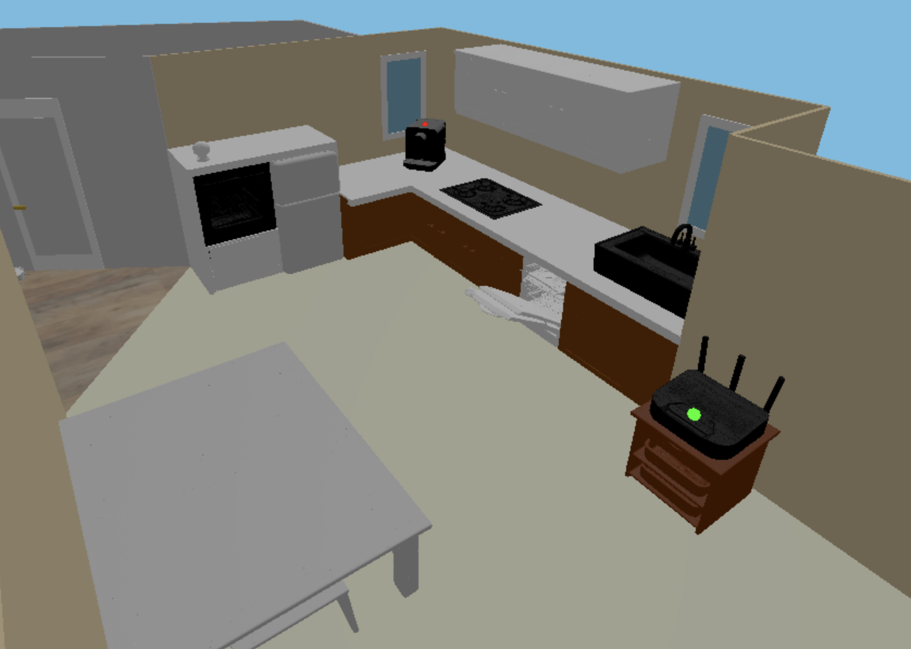

# HomeSphere

**HomeSphere** is a 3D smart home visualization project built with **Three.js**.  
It integrates local and Home Assistant environments, allowing control of real devices through an interactive 3D apartment model.

---

## Features

- **3D-rendered apartment** using `.glb` models for furniture, devices, and people.
- **Home Assistant integration** for live control of lights, sensors, and appliances.
- **piAlert integration** for network-based device status monitoring:
  - Uses local endpoint at **192.168.1.206** to fetch online/offline states.
  - Devices appear **green** when connected and **red** when offline.
- **Dynamic rendering modes**:
  - Mobile mode: loads only essential devices for faster performance.
  - Desktop mode: full 3D apartment visualization.
- Real-time environment control and feedback.

---

## piAlert Integration

HomeSphere connects to a **piAlert** server at `http://192.168.1.206` to retrieve real-time device connection statuses via its JSON endpoint.

Example endpoint:
```text
GET http://192.168.1.206/all```

The endpoint returns network information for all devices, including IP, name, and online status.  
Each device’s state is then reflected directly in the 3D visualization:

- **Green:** Device is online  
- **Red:** Device is offline  

This integration allows HomeSphere to visually represent the current home network state, providing live awareness of connected and disconnected devices within the virtual apartment.

---

## Visuals

| Description | Media |
|--------------|--------|
| Real lights synced with Home Assistant |  |
| Web-based 3D apartment control |  |
| Bedroom preview |  |
| Office preview |  |
| Kitchen preview |  |

---

## Installation

```bash
# Clone project
git clone <your_repo_url>
cd HomeSphere

# Install dependencies
npm install

# Clone Three.js into local folder
git clone https://github.com/mrdoob/three.js.git three
```

### Modify Two Files Inside `three/`:
**1. `/examples/jsm/controls/OrbitControls.js`**

Find:
```js
} from 'three';
```
Replace with:
```js
} from '../../../build/three.module.js';
```

**2. `/examples/jsm/loaders/GLTFLoader.js`**

Find:
```js
} from 'three';
```
Replace with:
```js
} from '../../../build/three.module.js';
```

---

## Running the App

```bash
# Local deployment (using relative paths)
python3 replace.py locally
serve .
```

If you are deploying inside **Home Assistant**, use:
```bash
python3 replace.py homeassistant
serve .
```

The script automatically updates internal paths from relative (`../three/...`) to absolute (`/local/HomeSphere/...`) for Home Assistant compatibility.

---

## Configuration

`config.js` file structure (excluded from repository for security):

```js
// config.js
export const CONFIG = {
    HA_ACCESS_TOKEN: '', // Home Assistant long-lived access token
    HA_WEBSOCKET_URL: '', // Home Assistant WebSocket URL
    HA_API_URL: '',       // Home Assistant REST API URL
};
```

Create this file manually in your project root before running the app.

---

## Repository Safety

Sensitive files such as `config.js`, `.env`, `.xlsx`, and temporary logs are excluded from version control via `.gitignore`.  
This ensures that private Home Assistant credentials and local configurations are never exposed on GitHub.

---

## Project Structure

```
HomeSphere/
├── config.js             # excluded from git
├── index.html
├── main.js
├── replace.py
├── proxy.js
├── models/               # 3D assets (.glb, textures, etc.)
├── people/               # 3D people models & behavior scripts
├── rooms/                # 3D room setup scripts
├── utils/                # Utility modules (Doors, Windows, Lights, etc.)
├── package.json
├── package-lock.json
└── README.md
```

---

**Author:** Christodoulos Stylianidis 
**License:** MIT  
**Tech Stack:** Three.js, JavaScript, Python (for path replacement), Home Assistant Integration
